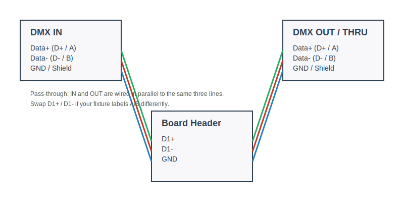

# DMX Wiring and Direction Control

This project uses the on-board MAX3485 RS-485 transceiver for DMX. The board is **not isolated** and **not terminated**, so termination must be added externally when the board is the last device on the line.

## Pins and Header

The 3-pin DMX/RS-485 header is:

- `D1+` = DMX Data+ (often labeled **D+** or **A**)
- `D1-` = DMX Data- (often labeled **D-** or **B**)
- `GND` = DMX Shield / Signal Ground

If your controller/fixture labels A/B the other way, simply **swap D1+ and D1-**.

**Important:** The RS-485/DMX header pins are **not pre-soldered** on the PCB. You must solder a 3‑pin header (or wires) before connecting DMX.

## DMX Input Only (current firmware mode)

When **Input Source = DMX** in the web UI, the firmware forces the transceiver into receive mode and reads DMX frames.

Wiring:

- DMX IN `Data+` → `D1+`
- DMX IN `Data-` → `D1-`
- DMX IN `GND`   → `GND`

The MAX3485 direction pin (`DMX_RTS`) is driven **LOW** in firmware, which overrides the on-board pull-up and keeps the chip in RX mode.

## DMX Pass-Through (IN → OUT in parallel)

If you want a **pass-through (DMX THRU)**, you can wire the **IN and OUT connectors in parallel** to the same three lines:

- `D1+` → DMX IN `Data+` and DMX OUT `Data+`
- `D1-` → DMX IN `Data-` and DMX OUT `Data-`
- `GND` → DMX IN `GND` and DMX OUT `GND`

This is a **passive parallel connection**, not an active repeater. It is fine for short runs and typical DMX daisy-chain wiring.

## DMX Output (future)

To drive DMX output, the MAX3485 must be put into transmit mode:

- `DMX_RTS` HIGH → transmit
- `DMX_RTS` LOW  → receive

When output is implemented, the firmware will toggle `DMX_RTS` and send DMX frames over UART at **250000 baud, 8N2**. Only one device should drive the DMX bus at a time.

## Termination

Because the board is **not terminated**, add a **120Ω termination resistor** across `D1+` and `D1-` **only if this board is the last device** on the DMX line.

## Notes and Troubleshooting

- If you see no data, swap `D1+` and `D1-`.
- Only add one termination at the end of the line.
- For DMX input-only, you do **not** need to remove the on-board `R3` pull-up; the firmware drives `DMX_RTS` low.
