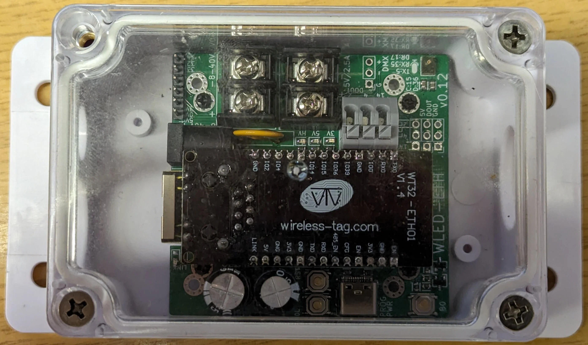
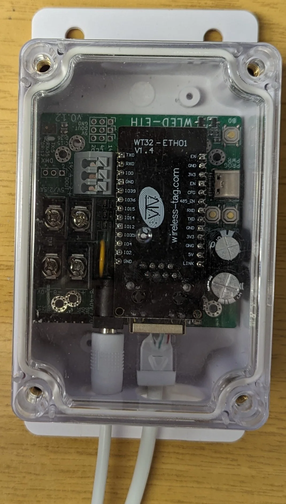
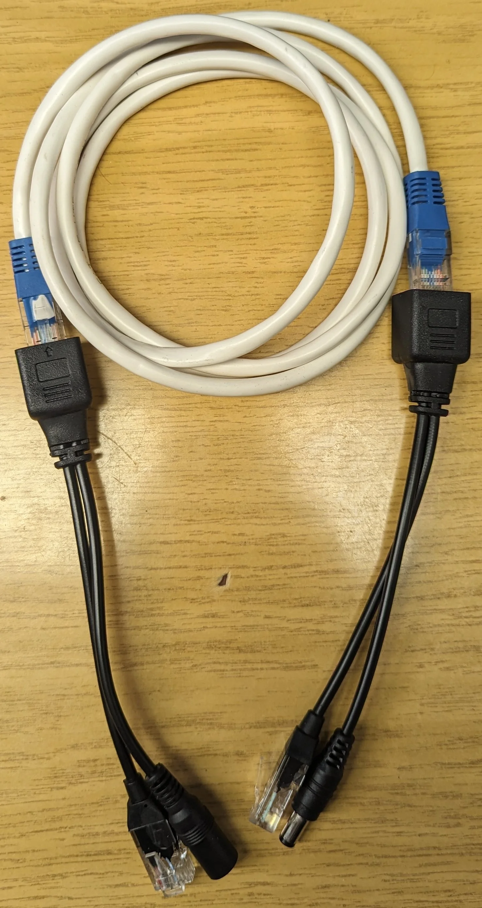
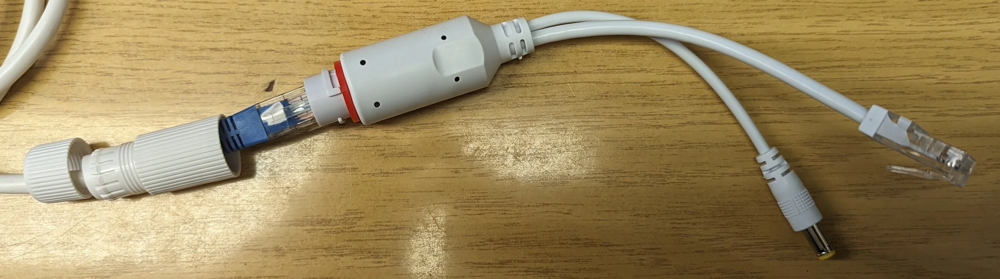
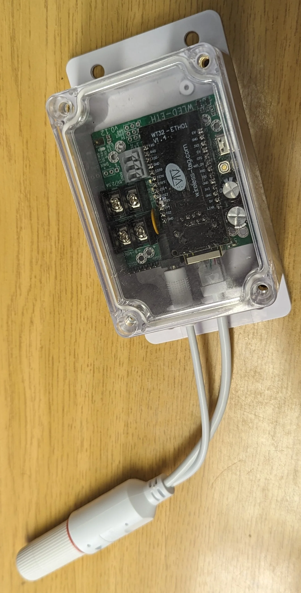
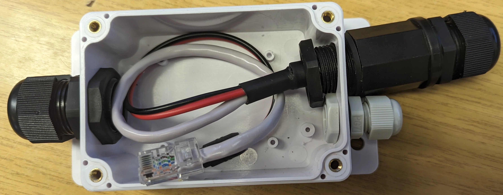
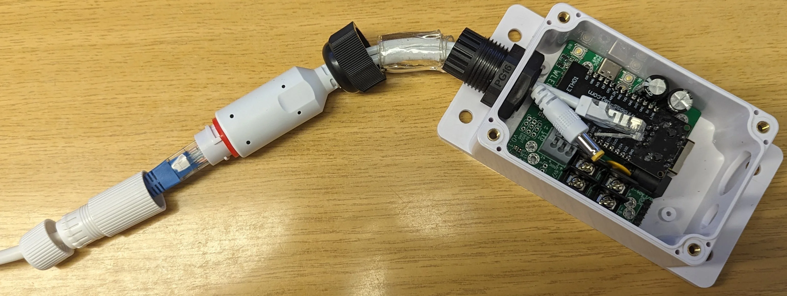
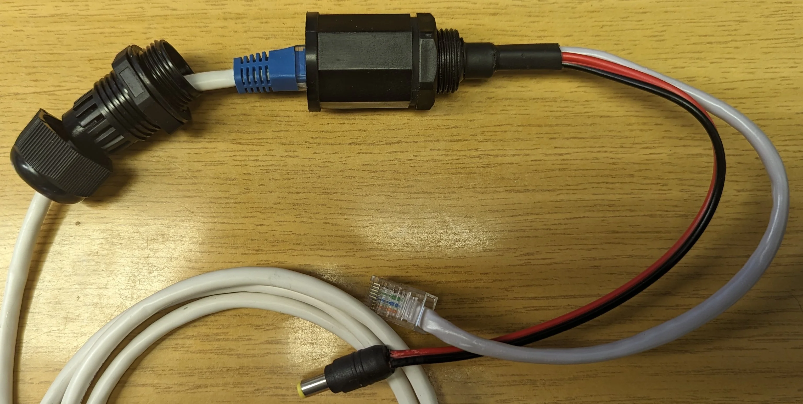
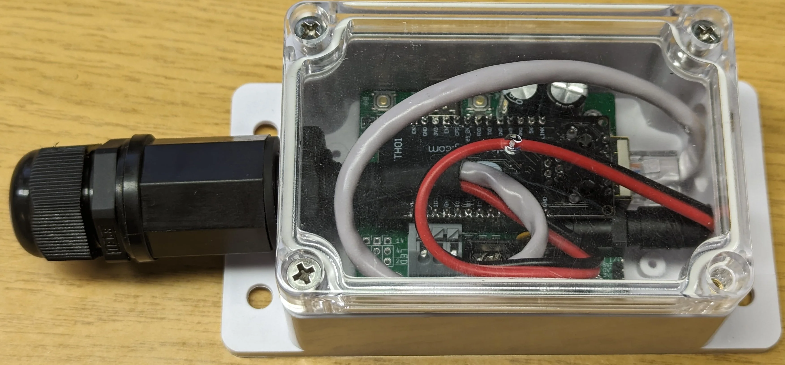

The board is designed to fit in a waterproof enclosure.
You can use a [sonoff](https://sonoff.tech/product/accessories/ip66/) enclosure (with flanged mounting holes), [clones](https://www.aliexpress.com/item/1005005402009860.html) (with different mounting holes), or generic [100x68x50 mm](https://www.aliexpress.com/item/1005005622148025.html) one.
The board can be screwed in the enclosure using 2 of the 6 mounting holes.

This has several advantages:

- electronics protection: nothing can fall on it and damage or short the board
- dust protection: keeps the board clean
- mounting on walls: robust location, and less of a trip hazard
- rain protection: allows outdoor installations
- water protection: allows even under-water installations (never tester)

The sonoff case comes pre-drilled with two 12 mm holes, and PG7 glands far cables from 3 to 6.5 mm thick.
If you don't care about water protection, you don't need to pass the cables through the glands, and can use the holes directly.
DC barrel jacks are around 10 mm thick, and fit in the hole directly.
RJ45 cables requires a 13 mm hole, thus you will have to make the hole larger (14 mm recommended).
When mounted vertically with the holes facing down, this is enough to provide rain protection.

Ethernet
========

Passive
-------

The ESP32 supports Ethernet speeds 10 and 100 Mbps.
This only requires 4 out of the 8 wires in Ethernet cables.
The 4 spare wires can be used to provide power, using Power-over-Ethernet (PoE, passive, alternative B).
Thus you only need one cable to power and communicate with the board.
This technique is very popular with IP cameras, and you can get splitters for [extremely cheap](https://www.aliexpress.com/item/1005007204354459.html).

You can inject any voltage the board supports.
Ethernet cables are rated for up to 125 Volts and around 2 Amperes.
WLED-ETH can handle 5 to 60V.
Thus, I like to use very common 12V 2.5A power supplies, which provides enough power for 5m of LED strip.

Active
------

You can get [water-proof splitters](https://www.aliexpress.com/item/1005005555489997.html), in case it is mounted outdoors.
There often work with passive injection, but also support IEEE 802.3af/at active PoE.
The drawback is that they include a voltage regulator, only able to provide limited 12V 2A output.

Gland
-----

To have the enclosure water proof, there are two solutions.
Because the PG7 cable glands are not large enough for the connectors, you need to cut them and pass the cables through.
The power wires can directly be mounted on the screw terminals.
For the RJ45 connector, you will need to [re-crimp it](https://www.aliexpress.com/item/1005005973889401.html).
This is my favourite solution.

The other solution, is to use [PG16 cable glands](https://www.aliexpress.com/item/1005003296249352.html).
They allow passing cables from 10 to 14 mm, thus also the RJ45 and barrel jack connectors.
You need to drill a 22 mm hole for it, on the opposite side, else it does not have enough space.
To seal the cable, use the rubber from a water-proof extractor, or use nano tape.

There are also [splitters](https://www.aliexpress.com/item/1005005687274740.html) to be mounted on enclosures.
But I find them very hard to fit in the box, and can't recommend them.

