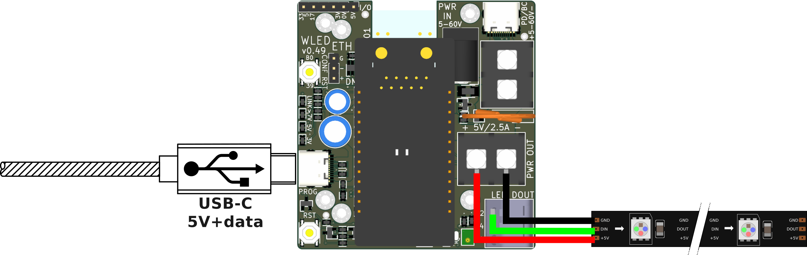
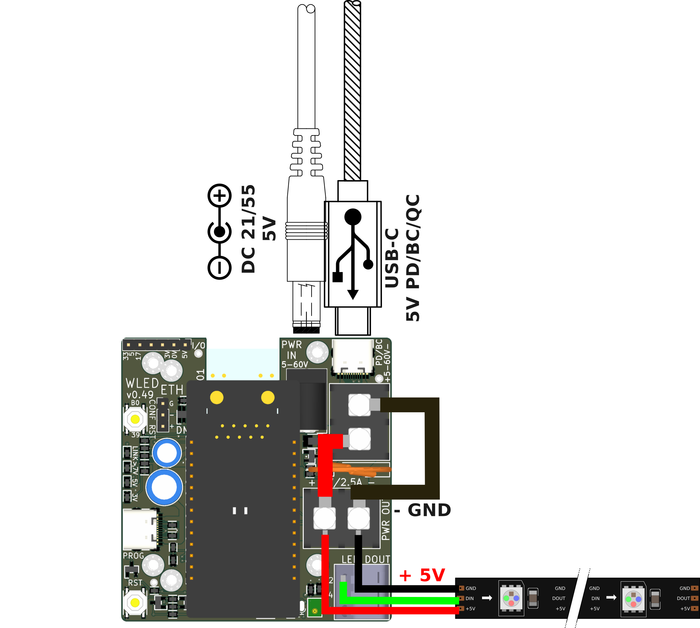
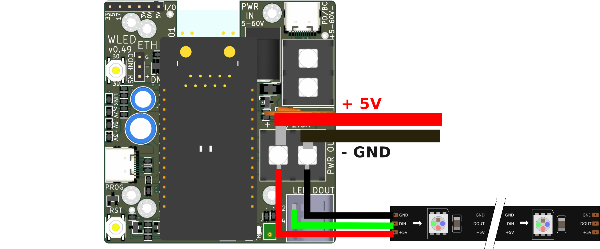
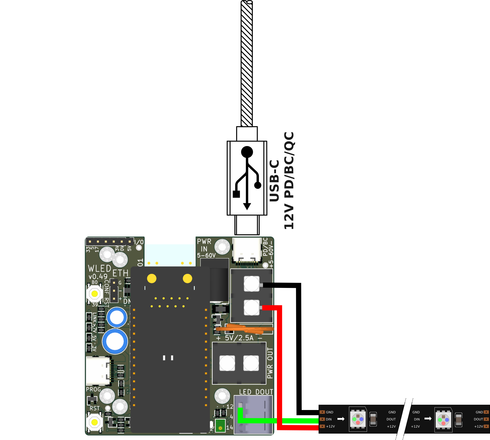

Here are examples for WLED-ETH installations, making use of its different capabilities.

scenario
========

Let's go from the most basic, to the most complex installation.
We will start with a standalone device.

For very tiny installations, with less than 60 LEDs, or 1 meters of 60 LEDs/meter strips:

- connect the 5V LED strip to the 5V screw terminal and the DIN wires to one of the 3 LED DOUT spring terminals port
- you can connect up to 3 LED strips using the 3 LED DOUT terminals
- use a 5V 3A USB power supply and connect it to the PROG USB-C port
- don't forget to specify the 2000 mA limit in the WLED LED configuration

For tiny installations, with 5 meters of 30 LEDs/meter strips:

- connect the 5V LED strip to the 5V screw terminal and the DIN of the strip to the LED DOUT spring terminals port
- use the screw terminal to also have separate wires for power injection on the LED strip in the middle and/or other end of it
- connect a 12V 2A (or any 7V to 60V) power supply to the barrel jack
- the on-board 5V regulator will provide power to the LEDs (up to 2.5A)

For small installations, with 10 meters of 30 LEDs/meter strips:

- connect the 5V LED strip to the 5V screw terminal and the DIN of the strip to the LED DOUT spring terminals port
- use the screw terminal to also have separate wires for power injection on the LED strip in the middle and/or other end of it
- connect a 5V 5A power supply to the barrel jack, or USB-C PD charger with 100W cable to the top USB-C port, but also ensure the switch under the WT32-ETH01 board is set to 5V
- inter-connect the two screw terminals to be sure 5V and more than 2.5A are available to the LED strips

For medium installations:

- connect the 5V LED strip ground and data wires to the board (see above)
- use an external 5V power supply powerful enough for the number of LEDs you want
- connect the external power supply to the 5V screw terminal
- connect the LED strip power pins to the power supply (on the 5V terminal on the board, or directly on the power supply)
- connect additional cables from the power supply to the strip to inject power every 2.5 meters (else the white will appear more orange)

For semi-large installations:

- connect the 12V LED strip ground and data wires to the board (see above)
- connect a 12V up to 5A power supply to the barrel jack
- connect the LED strip power pins to the power supply (on the 5V-60V terminal on the board, or directly on the power supply)
- thanks to the 12V supply, you need far less injection points (every 5-10 meters should be enough)
- the same applies for 24V or 48V LED strips
- you can also use a PD USB-C charger connected to the port on top, but also ensure the switch under the WT32-ETH01 board is set to request the right voltage from the charger

For large installations:

- connect the 12V LED strip ground and data wires to the board (see above)
- use an external 12V power supply powerful enough for the number of LEDs you want
- connect the external power supply to the 5-60V screw terminal
- connect the LED strip power pins to the power supply (on the 5V-60V terminal on the board, or directly on the power supply)
- the same applies for 24V or 48V LED strips

LED strip
=========

5V LED strips are very common an cheap, and suited for small installations.
But the LED strips have only small traces to carry the power, with non-negligible resistance.
The brighter the LED is, the current it uses, the higher will be the voltage drop.
This voltage drop accumulated along the LED strip, leaving the last LEDs on the strip with a lower voltage.
This cause the blue LED to not be as brightness, making the white more orange.

One way to compensate for this voltage drop it to use power injection.
Connect additional thicker wires from the power supply to the middle or end of the LED strip.
But this also requires large power supplies to be able to deliver more current.

Another way is to use 12V, 24V or 48V LED strips.
Thanks to the higher voltage, the LED require less current, reducing the voltage drop.
And a voltage drop on higher voltages has relatively less effect.
This requires far fewer power injection, or brighter lights.
It also makes the power supplies more compact, and allows using not as large cables.

power supply
============

The board has a built-in 5V DC-DC converter.
This allows powering the board using off-the-shelves 12V to 48V power supplies.
The power can come from the barrel jack, screen terminal, or top USB-C port cable.
The board with also provide 2.5A, enough power for the 5 meters of LED strips (not at full brightness).

For larger LED installations, connect the 5V or 12V LED strips directly to the external power supply suited to it.
Connect ground and data of the LED strip to the board.
Only connect one of the chained board to the power supply.
