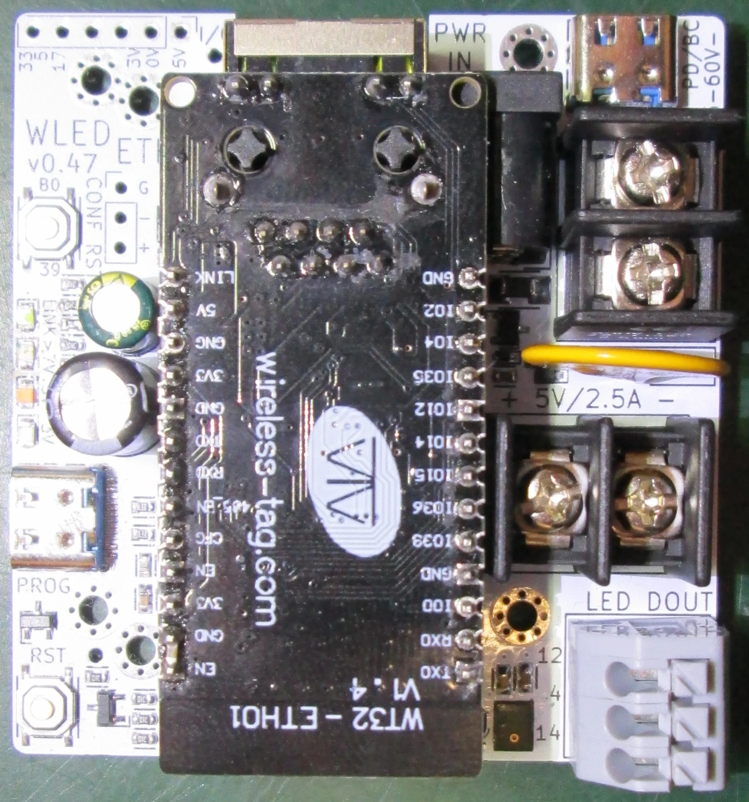
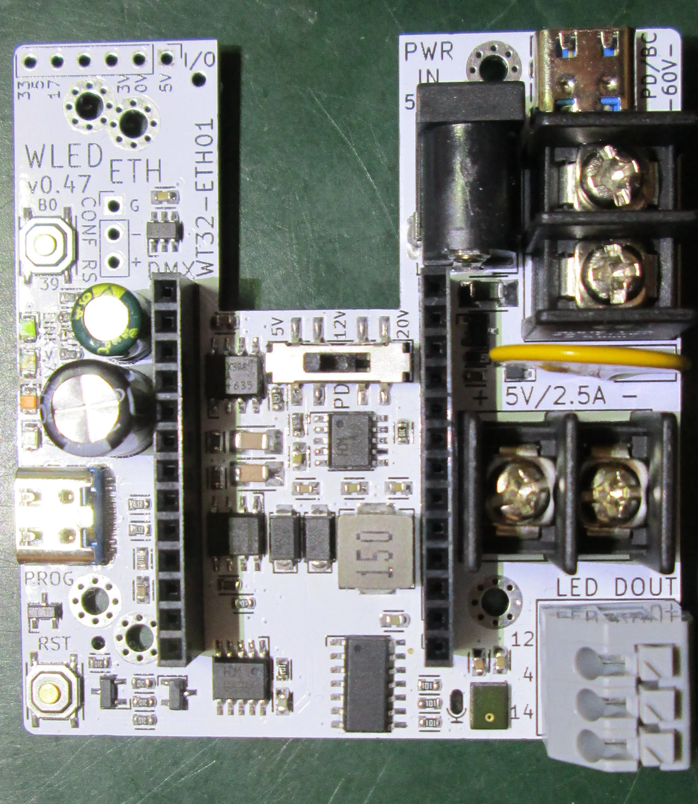
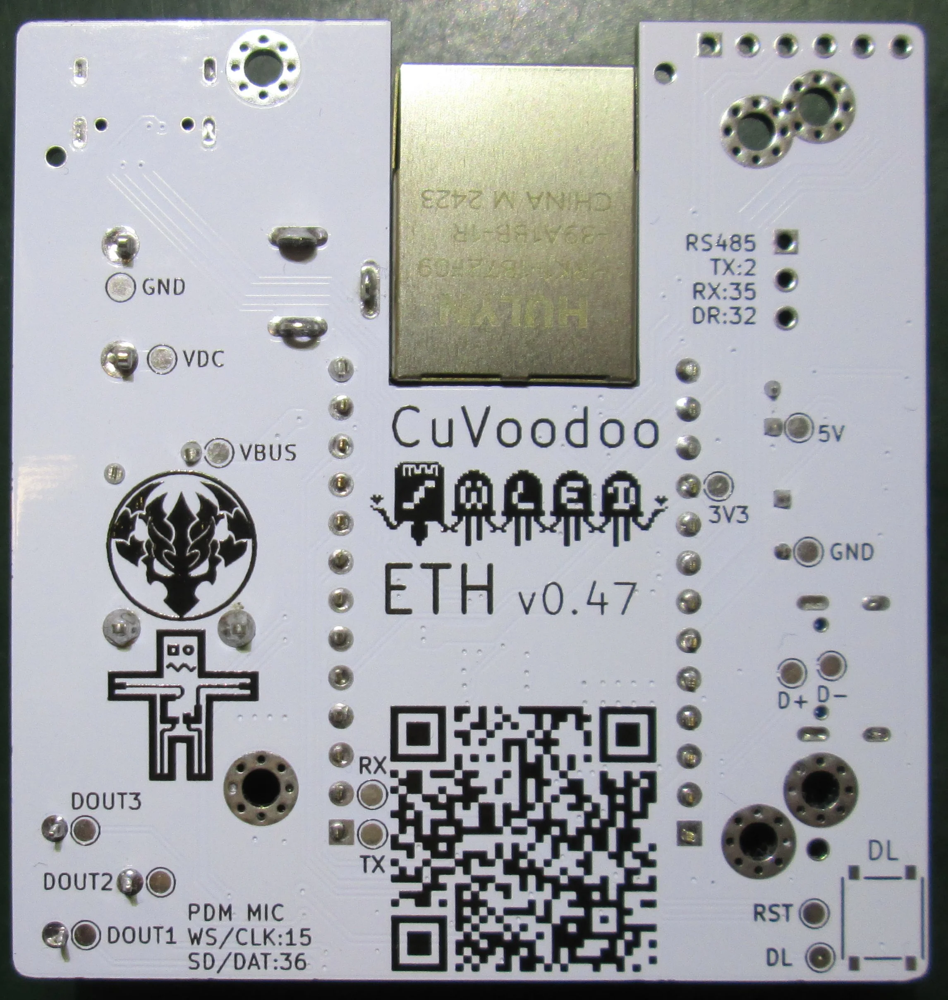

WLED-ETH is a board to run WLED and connect it over Ethernet.
It is meant as simple and not too expensive go-to solutions for remotely controlled LED strip based light installations at festivals.

features
========

Features it supports:

- 10/100 Mbits Ethernet connection: for stable, low-jitter, network connection, in particular ArtNet/sACN
- WiFi connection: because Ethernet is not always available, particularly when setting up the board
- 3 addressable LED strip outputs: with proper 5V level signal, and 100 Ohm conditioning
- 5 to 60V input: to power the board using any power supply, particularly when used with higher voltage LED strips
- USB-C Power Delivery: because these power supplies are getting ubiquitous (even if more expensive than dumb power supplies), and a practical easy solution for small installations
- 5V 2.5A output: an onboard regular allows powering a short LED strip (up to 5 meters) when used with higher voltage input
- fit in an [enclosure](ENCLOSURE.md): for dust and water protection, so it can be mounted outdoor
- I/O header: exposing 3 GPIOs for expansions (more digital LED strips, analogue LED strips, temperature sensor, relay, ...)
- DMX in/out (not isolated): because this protocol is still often used at festivals
- on-board microphone: for standalone audio-reactive effects

Feature it will not support:

- Power over Ethernet: Active PoE requires special, more expensive injectors, power supplies, and complex extractors in each device. There are plenty of relatively cheap injectors and extractors that you can use as external devices next to the boards. Instead, you can also use very cheap and primitive [passive splitters](ENCLOSURE.md), that use pins from the Ethernet cable not used by 10/100-Mbps Ethernet. They often come with a DC barrel jack, that you can directly plug into the board.

hardware
========

The WLED-ETH board uses the [WT32-ETH01 module](https://github.com/egnor/wt32-eth01).
You'll have to [buy it](WT32-ETH01.md) separately and plug it into the WLED-ETH.
It already comes with Ethernet support and is pretty cheap.
The components only already cost more then the board in low quantities, and there just isn't enough space on WLED-ETH to integrate them directly on the board.

The WLED-ETH board provides the additional functionalities:

- 5 to 60V high voltage input (e.g. for common 12V power bricks, or 48V LiPo batteries)
- Battery Charging and Power Delivery trigger for 5 to 20V USB power supplies
- 5V 3A output for WT32-ETH01 and LED strips. The WT32-ETH01 module uses around 0.5A, leaving 2.5A for LED strips.
- three 5V signal outputs for LED strips
- USB to UART converter to flash WLED, or any other software you want
- microphone input, for audio-reactive effects
- RS-485 port (not isolated), to connect to DMX (read and write for in and output)
- nice and sturdy terminal connectors for power and signals

Peripheral connections (all indicated on the board):

- LED data outputs: GPIO14, GPIO4, GPIO12
- button 0 input: GPIO39
- I2S PDM microphone input:
  - data input: GPIO36
  - clock output: GPIO15
- RS-485 interface (for DMX):
  - enable/drive: GPIO32
  - TX: GPIO2
  - RX: GPIO35
- I/O expansion port (to connect additional user peripherals):
  - 3.3V and 5V power
  - 3 GPIOs: GPIO33, GPIO5, GPIO17 (GPIO5 and GPIO17 have an LED connected to them on the W32-ETH01 board, sink on)

The board comes with 3 buttons:
  - RST: to reset the board
  - DL: to put the ESP32 in download more upon power-up (or releasing the reset button). The DL button is on the back, not populated, because there is an auto reset circuit over USB on the board
  - B0/CONF RST: to reset the WLED access point credentials when held for 6 seconds, or reset all configuration when held for 12 seconds

The WT32-ETH01 heats quite a lot.
While it is not pleasant to the touch, we did not see any issues even after 24 hours of operation.

usage
=====

Once you have the WLED-ETH and plugged in a WT32-ETH01 on it:

- [flash WLED](FLASHING.md) and configure it
- put it in an [enclosure](ENCLOSURE.md)
- have fun and let lights blink

If you want to reset it, press and hold the B0/CONF RST button for 12 seconds while powering up.
This will reset configuration, so you can start from scratch at the next installation.

installation
============

There are several ways to power the board, providing quite an installation flexibility.
Find [here more details](POWER.md).

This allow for very different types of installations, depending on your needs.
Find [here some examples](INSTALLATION.md).

accessories
===========

While the board already includes most peripherals to immediately get started for small installations, here are a couples of accessories for larger or more specific installations:

- an [IP66 box](https://www.aliexpress.com/item/1005005402009860.html), to provide a waterproof/weatherproof [enclosure](ENCLOSURE.md)
- a dedicated external DC-DC step-down regulator, such as this [waterproof option](https://www.aliexpress.com/item/1005007217303825.html), if you require more than 3A 5V
- [passive PoE splitter](https://www.aliexpress.com/item/1005007204354459.html), often used with IP cameras, a cheap way to transport power (max. 2A) over Ethernet cables (using wires not used by 100 Mbits/s Ethernet)
- [active PoE extractor](https://www.aliexpress.com/item/1005005697883353.html), for fancy PoE capable networks (gigabit splitters include proper extractor circuit). Note that they all come with an embedded voltage regulator to output 5V or 12V instead of the raw voltage (which WLED-ETH also supports)
- [Ethernet 1 to 2 splitter](https://www.aliexpress.com/item/1005007125107433.html), to chain WLED-ETH boards. Look for gigabit and 5V USB input power to be sure there are actually switches

The enclosure has enough headroom to include most accessories.

alternative
===========

There are already several alternatives that support WLED and Ethernet, but none fulfilled all my needs:

- [WLED chain](https://git.cuvoodoo.info/kingkevin/board/src/branch/wled_chain): no Ethernet (the RJ45 ports are for DMX512), but can be chained (ideal for long installations).
- [MLP201207](https://mottramlabs.com/pixel_products.html): the best match, but just does not fit in a waterproof enclosure
- [QuinLED-Dig-Quad](https://quinled.info/pre-assembled-quinled-dig-quad/): Ethernet is optional
- [8 Port LED Distro](https://github.com/bobko69/8PortLEDDistro): similar to QuinLED-Dig-Quad
- [QuinLED-Dig-Octa System](https://quinled.info/quinled-dig-octa/): similar to 8 Port LED Distro, just beefier
- [LilyGO T-ETH series](https://github.com/Xinyuan-LilyGO/LilyGO-T-ETH-Series): some board even support PoE, but none with 5V signal output
- [ENTTEC OCTO](https://www.enttec.com/sku/71521): no WLED, and not cheap
